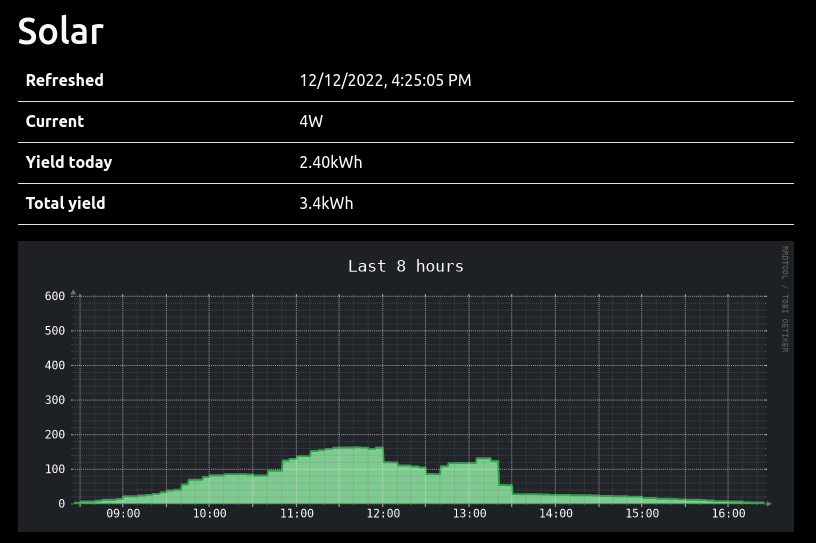

This is my small framework to fetch, store and display data from my Bosswerk inverter.



## How it works

1. The script fetches the `status.html` from the inverter and converts the inline JavaScript variables to JSON.
3. The current power value is written into a rrd for graphing purposes.
4. The script generates svg graphs for different timespans.
5. The `www` subdirectory can be published to access the index page with current and historical data.

## Dependencies

- bash
- curl
- rrdtool

## Usage

### 1. Do not run this script as root, create a separate user for it.

```
useradd -m solar
sudo -i -u solar
```

### 2. Clone the repo

```
git clone https://github.com/jcorporation/bosswerk.git
```

### 3. Add the http uri to fetch data from

```
cd bosswerk
echo "PV_URI=\"http://10.10.100.254/status.html\"" > .config
```

### 4. Add a .netrc file for authentication (user home)

```
cat > ~/.netrc << EOL
machine 10.10.100.254
login admin
password admin

EOL
```

### 5. Test the script

```
./solar.sh
```

After the first run, there should be following new files:

- `rrd/solar.rrd`: the rrd file with historical data
- `www/data/data.json`: the json data file
- `www/graphs/last_*.svg`: the svg graphs of historical data

### 6. Add a crontab entry

Run the script only at daytime every 5 minutes. The rrdfile expects one datapoint each 5 minutes.

```
*/5 6-20 * * *	/home/solar/bosswerk/solar.sh 2>&1 | logger -p local1.info
```

### 7. Publish

Publish the `www` directory via nginx:

```
location /bosswerk {
  alias /home/solar/bosswerk/www;
}
```
